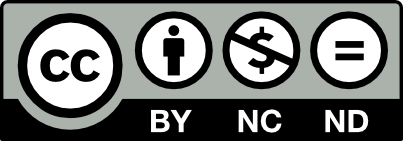

# Everscale Whitepaper

> It is impossible to have a radical philosophy
>
> without at first sounding like a lunatic or a moron
>
> — Michael Malice, “The Anarchist Handbook”

#### Acknowledgements 

There are dozens of people, hundreds of authors and thousands of Everscale community members who have directly or indirectly helped write this paper. Here I would like to mention by name just a handful of people who had a direct contribution to the ideas, implementation and formalization of different concepts described in it.

Because of the sheer volume of the topics to cover, this paper should be viewed more like a framework of ideas and design blueprints to be further discussed in separate documents, some of which are already available (links to them are provided throughout the paper) and some are still under development.

I feel privileged to work with most talented people in their respective areas:

Pavel Prigolovko, Andrey Lyashin, Dmitry Shtukenberg, Leonid Kholodov, Kirill Zavarovsky, Nikita Monahov, Anton Serkov, Andrew Zhogin, Slava Belenko, Boris Ivanovsky, Sergey Yaroslavtsev, Victor Bargachev, Igor Kovalenko, Alexey Shistko, Michael Skvortsov, Michael Vlasov, Ekaterina Pantaz, Vasily Selivanov, Luca Goroshevsky, Ivan Suvorov\\

Special thanks goes to all those who contributed to editing: Eugene Morozov, Joanne Eberhardt and Benjamin Bateman.

This Whitepaper is licensed under [Attribution-NonCommercial-NoDerivatives 4.0 International (CC BY-NC-ND 4.0) Creative Commons License](https://creativecommons.org/licenses/by-nc-nd/4.0/)

Download a PDF:


